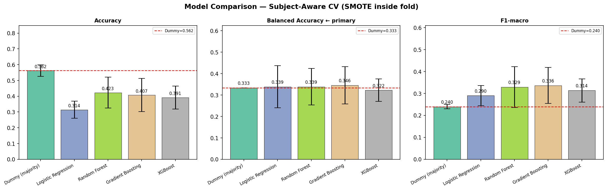

# 🧠 EEG Meditation Depth Classification

This project focuses on predicting meditation levels using EEG (brainwave) signals with machine learning techniques.

---

## 📊 Overview

Meditation affects brainwave activity across different frequency bands such as Delta, Theta, Alpha, Beta, and Gamma.  
This project uses these signals to classify meditation depth into three levels:

- Level 1 → Low / No Meditation  
- Level 2 → Moderate Meditation  
- Level 3 → Deep Meditation  

---

## 🚀 Key Features

✅ EEG-based feature analysis  
✅ Advanced feature engineering (ratio-based features)  
✅ Class imbalance handling using SMOTE  
✅ LightGBM-based classification model  
✅ Stratified cross-validation  
✅ Feature importance analysis  

---

## 🧠 Dataset Description

- Total Samples: **359**
- Features: **EEG band power values**
- Brain Regions:
  - Frontal
  - Parietal

### Brainwave Types:
- Delta (Deep relaxation)
- Theta (Meditation)
- Alpha (Calm state)
- Beta (Active thinking)
- Gamma (High-level processing)

---

## ⚙️ Feature Engineering

The following engineered features significantly improved performance:

- Alpha/Beta Ratio  
- Theta/Alpha Ratio  
- Delta/Gamma Ratio  
- Theta/Beta Ratio  
- Parietal Alpha/Beta Ratio  

These features help capture **neuroscientific relationships** between brainwaves.

---

## 🤖 Model Used

- LightGBM Classifier
- SMOTE for class balancing
- Stratified 5-Fold Cross Validation

---

## 📈 Results

| Metric | Score |
|------|--------|
| Accuracy | 0.54 |
| Balanced Accuracy | 0.47 |
| Macro F1 Score | 0.45 |

### Class-wise Performance:

- Level 1 → Strong performance  
- Level 2 → Moderate performance  
- Level 3 → Challenging due to limited data  

---

## 📊 Key Insights

- Theta/Alpha ratio is a strong indicator of meditation depth  
- Beta activity decreases during meditation  
- Deep meditation is harder to classify due to overlapping EEG patterns  

---

## ⚠️ Limitations

- Small dataset (359 samples)  
- Class imbalance (fewer deep meditation samples)  
- EEG signals are inherently noisy  

---

## 🔮 Future Work

- Use deep learning models (CNN/LSTM)  
- Collect larger EEG datasets  
- Add real-time meditation tracking system  
- Integrate wearable EEG devices  

---

## 🛠️ Tech Stack

- Python  
- Scikit-learn  
- LightGBM  
- Pandas, NumPy  
- Matplotlib / Seaborn  

---

## 📂 Project Structure

## 📊 Results & Visualizations
### 📈 Model Comparison (Cross Validation)

### 📋 CV Summary Table

### 🔍 Confusion Matrix

### 🧠 Feature Importance

---

## 👩‍💻 Author
Manya

---

## ⭐ If you found this useful, consider starring the repo!
